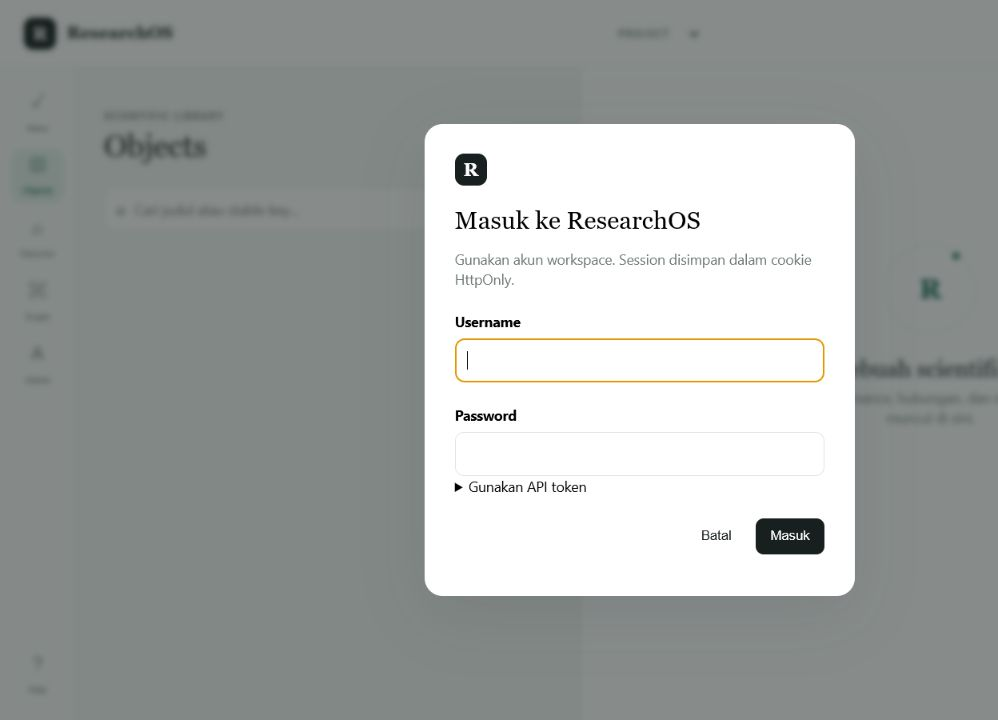

# ResearchOS

[](https://github.com/jumadi03/ResearchOS/actions/workflows/architecture-quality-gates.yml)
[](LICENSE)
[](AI-Gateway/pyproject.toml)

ResearchOS is an experimental, provenance-first platform for scientific
knowledge workflows and deterministic software architecture governance. It
combines a FastAPI application, PostgreSQL with pgvector, MinIO object storage,
resilient background workers, and an observable local deployment.

ResearchOS preserves a strict boundary between machine assistance and human
decisions. AI-generated material is advisory: it cannot silently promote
evidence, approve theories, or declare architecture compliance.



The browser workspace provides role-separated access to scientific objects,
literature discovery, provenance, review queues, knowledge graphs, and
administration. Credentials remain in ignored local files and are never stored
in this repository.

## Current capabilities

- Literature discovery with versioned provider snapshots and provenance.
- Content-addressed scientific document and representation storage.
- Evidence extraction, human review, knowledge graphs, and theory synthesis.
- Research-gap detection, validation reports, and reproducible publications.
- Deterministic architecture graphs, compliance review, and ARC packages.
- PostgreSQL migrations, MinIO bootstrap, background-job recovery, monitoring,
  and verified backups.
- Role-separated bearer tokens and browser sessions with auditable lifecycle.

## Project status

The project is under active development and its public interfaces may change.
It is not a substitute for scientific peer review, professional judgment, or
regulatory validation. Review the trust boundaries in the project documents
before using outputs in consequential workflows.

## Quick start

For the complete first-run walkthrough, including verification, credentials,
safe shutdown, and troubleshooting, read
[ResearchOS in 5 Minutes](Documents/GETTING_STARTED.md).

Requirements:

- Docker Desktop with Docker Compose
- Git
- Python 3.13 for local development

Clone and bootstrap the local deployment:

```powershell
git clone https://github.com/jumadi03/ResearchOS.git
Set-Location ResearchOS
py -3.13 Scripts\bootstrap_local.py
```

The bootstrap command generates unique credentials, starts the canonical stack,
creates five role-separated accounts, verifies login and MinIO access, and
stores the credentials only in ignored local files. It can be run again safely:
existing complete credentials are reused rather than silently rotated.

Never commit `deploy/stack.env`, `deploy/local-access.env`, `.env`, or
monitoring tokens. To create configuration without starting Docker, add
`--configuration-only`.

Local endpoints:

- API: `http://127.0.0.1:8080`
- API documentation: `http://127.0.0.1:8080/docs`
- MinIO console: `http://127.0.0.1:9101`
- Prometheus: `http://127.0.0.1:9090`
- Grafana: `http://127.0.0.1:3000`

Do not run `docker compose down --volumes` unless permanent deletion of local
databases, objects, monitoring history, and backups is intended.

## Development

```powershell
Set-Location AI-Gateway
py -3.13 -m venv .venv
.\.venv\Scripts\Activate.ps1
python -m pip install -e ".[dev]"
python -m pytest -q --basetemp=..\.tmp\pytest
```

Pull requests must pass regression, knowledge-product, deployment, storage,
schema and persistence, and dependency-security gates.

## Documentation

- [ResearchOS vision](Documents/RESEARCHOS_VISION.md)
- [Scientific Governance Framework (SGF-000)](Documents/SCIENTIFIC_GOVERNANCE_FRAMEWORK.md)
- [Autonomous intelligence roadmap](Documents/AUTONOMOUS_INTELLIGENCE_ROADMAP.md)
- [Scientific interface vision](Documents/SCIENTIFIC_INTERFACE_VISION.md)
- [Responsible evolution vision](Documents/RESPONSIBLE_EVOLUTION_VISION.md)
- [Long-term engineering charter](Documents/LONG_TERM_ENGINEERING_CHARTER.md)
- [Maintenance baseline audit and roadmap](Documents/MAINTENANCE_BASELINE_AUDIT.md)
- [ResearchOS in 5 Minutes](Documents/GETTING_STARTED.md)
- [Your first ResearchOS workflow](Documents/FIRST_RESEARCH_WORKFLOW.md)
- [End-to-end scientific workflow pilot](Documents/END_TO_END_PILOT.md)
- [Multi-source scientific workflow pilot](Documents/MULTI_SOURCE_PILOT.md)
- [Theory validation and risk-of-bias guide](Documents/VALIDATION_GUIDE.md)
- [ResearchOS v0.4.0 launch announcement](Documents/LAUNCH_ANNOUNCEMENT.md)
- [Local deployment and operations](Documents/LOCAL_STACK.md)
- [Scientific data storage architecture](Documents/SCIENTIFIC_DATA_STORAGE.md)
- [Scientific knowledge roadmap](Documents/SCIENTIFIC_KNOWLEDGE_ROADMAP.md)
- [Internet discovery roadmap](Documents/INTERNET_DISCOVERY_ROADMAP.md)
- [Internet discovery consolidation report](Documents/INTERNET_DISCOVERY_CONSOLIDATION_REPORT.md)
- [Architecture governance](Documents/ARCHITECTURE_GOVERNANCE.md)
- [File management architecture](Documents/FILE_MANAGEMENT_ARCHITECTURE.md)
- [File management completion and safety baseline](Documents/FILE_MANAGEMENT_SAFETY_BASELINE.md)
- [Storage compliance report](Documents/STORAGE_COMPLIANCE_REPORT.md)
- [AI Gateway details](AI-Gateway/README.md)

## Contributing and security

Read [CONTRIBUTING.md](CONTRIBUTING.md) before opening a pull request. Report
security vulnerabilities privately according to [SECURITY.md](SECURITY.md);
do not disclose credentials or vulnerabilities in a public issue.
For usage questions, reproducible bugs, feature proposals, and documentation
problems, choose the appropriate channel in [SUPPORT.md](SUPPORT.md).

## Citation

Academic users can cite the project using [CITATION.cff](CITATION.cff).

## License

Copyright 2026 Jumadi. Licensed under the
[Apache License 2.0](LICENSE).
